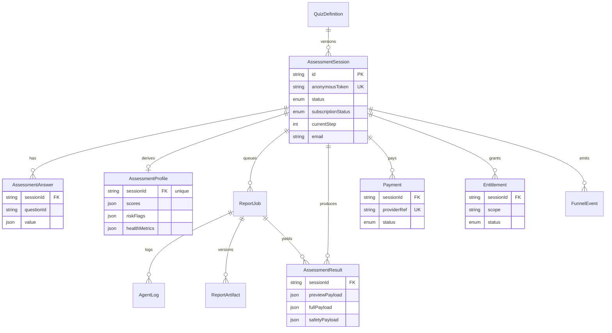

# Standout Health Funnel

AI-assisted health assessment funnel built for the Ruiqi full-stack challenge.

**Live demo:** https://healthtwins.site

This is not a simple form app. It models the core infrastructure behind a BetterMe/Noom-style health funnel: versioned quiz, resumable anonymous sessions, a server-side health-assessment algorithm (BMI, calorie target, goal date), deterministic scoring, async AI report generation with an independent safety reviewer, a simulated payment callback, subscription-gated results, analytics events, and a full unit + integration test suite with CI.

## How it maps to the challenge

| Spec requirement | Where |
| --- | --- |
| Step-wise save (分步保存) | `PATCH /api/assessment-sessions/:id/answers` |
| Progress recovery (进度恢复) | anonymous token → `POST /api/assessment-sessions`, `GET /api/assessment-sessions/:id` |
| Health algorithm: BMI / intake / target date | `src/lib/health-metrics.ts` |
| Result persistence | `AssessmentProfile.healthMetrics`, `AssessmentResult` |
| Subscription gating + masking | `GET /api/results/:id` + `src/lib/entitlement.ts` |
| Simulated pay callback (/pay) | `POST /api/pay` (and `POST /api/checkout/mock`) |
| Input validation / injection guards | `src/lib/answer-validation.ts` |
| Automated tests (unit + integration) | `src/**/*.test.ts`, `tests/integration/**` |
| CI | `.github/workflows/ci.yml` |

## Stack

- Next.js App Router, React, TypeScript, Tailwind CSS
- Prisma + PostgreSQL
- Redis + BullMQ worker (async AI report generation)
- Zod validation
- Vitest (unit + integration), GitHub Actions CI

## Local Setup

```bash
cp .env.example .env
docker compose up -d
npm install
npm run db:deploy   # apply migrations
npm run db:seed     # seed quiz + demo sessions
npm run dev         # web app
npm run worker      # in a second terminal: report worker
```

Docker maps Postgres to `localhost:55432` and Redis to `localhost:56379` to avoid common local port conflicts. Open `http://localhost:3000`.

## Health-assessment algorithm

`src/lib/health-metrics.ts` is a pure, unit-tested function that turns gender, age, height, weight, target weight and activity into:

- **BMI** and category (`weight / height²`)
- **BMR** via Mifflin-St Jeor (gender-aware), **TDEE** via activity factor
- **Recommended daily intake** (calorie target + protein/carb/fat macros), with a safety floor so a deficit never drops below a sane minimum
- **Estimated target date** to reach goal weight, from the energy balance implied by the recommendation (7700 kcal/kg model), capped at a sane horizon
- A **weight projection** curve

## Subscription, masking, and the pay callback

Non-members get a redacted result: BMI is shown as a hook, but the **calorie target, macros, target date, weekly projection, and full 4-week plan are stripped out server-side** and flagged `locked`. The `/api/pay` callback flips the session `subscriptionStatus` to `ACTIVE`, records a paid `Payment`, and grants the `assessment.full_plan` entitlement in one transaction. After that the result endpoint returns the full, unlocked payload.

### Reviewer flow (cURL)

The seed creates a stable **unpaid** session (token `demo-health-twin-unpaid`) and a **pre-paid** session (token `demo-health-twin-token`). Resolve a `sessionId` from the token, then diff before/after payment:

```bash
APP=https://healthtwins.site

# 1. Resolve the sessionId for the unpaid demo session
SID=$(curl -s -X POST $APP/api/assessment-sessions \
  -H 'content-type: application/json' \
  -d '{"anonymousToken":"demo-health-twin-unpaid"}' | jq -r .session.id)

# 2. Masked result (access=preview, calories/targetDate/projection = null, locked=true)
curl -s $APP/api/results/$SID | jq '{access, healthMetrics}'

# 3. Simulated payment callback
curl -s -X POST $APP/api/pay -H 'content-type: application/json' \
  -d "{\"sessionId\":\"$SID\"}" | jq

# 4. Full result (access=full, calories/targetDate/projection populated)
curl -s $APP/api/results/$SID | jq '{access, healthMetrics}'

# The pre-paid session is already unlocked:
PSID=$(curl -s -X POST $APP/api/assessment-sessions -H 'content-type: application/json' \
  -d '{"anonymousToken":"demo-health-twin-token"}' | jq -r .session.id)
curl -s $APP/api/results/$PSID | jq '{access, healthMetrics}'
```

## Verification

```bash
npm run typecheck
npm run lint
npm test              # unit tests (no infra needed)
npm run test:integration   # integration tests (needs a running Postgres)
npm run build
```

`npm run test:all` runs both suites. CI (`.github/workflows/ci.yml`) runs typecheck, lint, unit tests, migrations, integration tests, and build on every push/PR with a Postgres service.

## Test coverage — what, why, and what's not covered

**Unit (`npm test`, no infra):**
- `health-metrics.test.ts` — the assessment algorithm: BMI/BMR/TDEE math, deficit/surplus/maintain branches, calorie floor, target-date projection, boundary heights/weights, extreme weight gaps (capped), and **illegal (NaN / non-positive / Infinity) inputs**.
- `answer-validation.test.ts` — server-side input guards: out-of-range numbers, non-numeric injection (e.g. `"70; DROP TABLE"`, `{$gt:0}`), unknown option values, non-integer scales, multi de-duplication.
- `scoring.test.ts` — deterministic scoring incl. pain/sleep/nutrition signals.
- `report-generator.test.ts` — schema-valid 4-week plan + safety disclaimer + constraint propagation.

**Integration (`npm run test:integration`, real Postgres):**
- `step-save.test.ts` — incremental save, `currentStep` advance, **resume by token**, **out-of-order** and **duplicate** submits (idempotent upsert), **concurrent updates** (single consistent row), and **422 on out-of-range/injection** with nothing persisted.
- `subscription.test.ts` — end-to-end **masked → /pay → full** transition, DB `subscriptionStatus` flip, and 404 on paying a non-existent session.

**Why these:** they target the five things the brief grades — API design, data modeling, persistence/state consistency, the subscription/pay closure, and boundary/异常 coverage.

**Not covered (and why):** the BullMQ worker's live LLM path is not asserted in CI — the report writer has a deterministic fallback and the safety reviewer is exercised via `report-generator`, so integration tests seed `AssessmentResult` directly to avoid a Redis/LLM dependency in CI. UI is smoke-tested manually (the brief excludes UI from grading). A Playwright script is scaffolded (`npm run test:e2e`) but not part of CI.

## Database schema



## AI usage retrospective

- **Data modeling:** used AI to pressure-test the schema — splitting `AssessmentResult` into `previewPayload` / `fullPayload` / `safetyPayload` so the subscription boundary is enforced in the data shape, not just at the view layer.
- **Algorithm + tests:** the health-metrics formulas and their boundary/illegal test matrix (NaN, non-positive, extreme gaps) were drafted with AI, then hand-verified against known BMI/Mifflin-St Jeor values.
- **Agent architecture:** the report pipeline is a writer → independent safety-reviewer reflection loop (`src/lib/report-generator.ts`); only reviewer-approved copy is used, otherwise it falls back to deterministic copy.
- **A suggestion I rejected:** AI first proposed a single `isSubscribed` boolean on the session and masking data only in the React component. I rejected it — that leaks the full plan over the wire (any user could read it in DevTools). I moved masking server-side in `GET /api/results/:id` and kept an `Entitlement` scope model so gating is authoritative and extensible. AI also proposed storing computed calories in the browser and trusting them on `/pay`; rejected for the same trust-boundary reason — all metrics are computed and persisted server-side.

## Docs

- `docs/architecture.md`
- `docs/api.md`
- `docs/demo-script.md`
- `docs/deployment.md`
