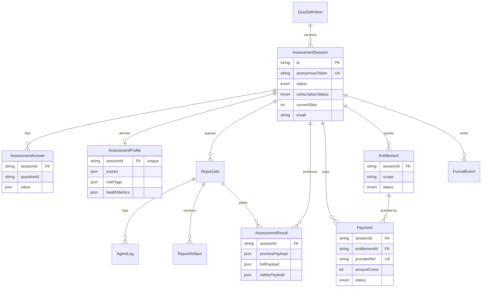

# 健康评估漏斗(Standout Health Funnel)

为「睿迄科技全栈开发 3 天挑战」构建的 AI 辅助健康评估漏斗。

**线上体验:** https://healthtwins.site

这不是一个简单的表单应用,而是一套 BetterMe/Noom 式健康漏斗的核心基础设施:版本化问卷、可恢复的匿名会话、服务端健康评估算法(BMI、热量目标、达标日期)、确定性打分、带独立安全审查的异步 AI 报告生成、模拟支付回调、按订阅分级的结果、埋点分析,以及完整的单元 + 集成测试和 CI。

## 与挑战要求的对应关系

| 挑战要求 | 实现位置 |
| --- | --- |
| 分步保存 | `PATCH /api/assessment-sessions/:id/answers` |
| 进度恢复 | 匿名 token → `POST /api/assessment-sessions`、`GET /api/assessment-sessions/:id` |
| 健康算法:BMI / 建议摄入 / 达标日期 | `src/lib/health-metrics.ts` |
| 结果持久化 | `AssessmentProfile.healthMetrics`、`AssessmentResult` |
| 订阅鉴权 + 脱敏 | `GET /api/results/:id` + `src/lib/entitlement.ts` |
| 模拟支付回调(/pay) | `POST /api/pay`(以及 `POST /api/checkout/mock`) |
| 输入校验 / 防注入 | `src/lib/answer-validation.ts` |
| 自动化测试(单元 + 集成) | `src/**/*.test.ts`、`tests/integration/**` |
| 持续集成 CI | `.github/workflows/ci.yml` |

## 技术栈

- Next.js App Router、React、TypeScript、Tailwind CSS
- Prisma + PostgreSQL
- Redis + BullMQ worker(异步 AI 报告生成)
- Zod 校验
- Vitest(单元 + 集成)、GitHub Actions CI

## 本地启动

```bash
cp .env.example .env
docker compose up -d
npm install
npm run db:deploy   # 应用数据库迁移
npm run db:seed     # 写入问卷 + 演示会话
npm run dev         # Web 应用
npm run worker      # 另开一个终端:报告 worker
```

Docker 把 Postgres 映射到 `localhost:55432`、Redis 映射到 `localhost:56379`,以避免常见的本地端口冲突。打开 `http://localhost:3000`。

## 健康评估算法

`src/lib/health-metrics.ts` 是一个纯函数、可单元测试,把性别、年龄、身高、体重、目标体重和活动量转换为:

- **BMI** 及分级(`体重 / 身高²`)
- 用 Mifflin-St Jeor(区分性别)计算 **BMR**,再用活动系数得到 **TDEE**
- **每日建议摄入**(热量目标 + 蛋白/碳水/脂肪三大营养素),并设有安全下限,使减脂方案也不会低于合理最低值
- 由建议摄入所隐含的能量平衡推算的 **预计达标日期**(7700 kcal/kg 模型),并设有合理上限
- 一条 **体重预测曲线**

## 订阅、脱敏与支付回调

非会员拿到的是脱敏结果:BMI 作为钩子展示,但 **热量目标、三大营养素、达标日期、每周预测曲线以及完整 4 周计划都在服务端被剥离**,并标记为 `locked`。`/api/pay` 回调会在同一个事务里把会话的 `subscriptionStatus` 翻转为 `ACTIVE`、记录一条已支付 `Payment` 并发放 `assessment.full_plan` 权益。此后结果接口即返回完整、解锁的内容。

### 评审流程(cURL)

seed 会创建一个稳定的**未支付**会话(token `demo-health-twin-unpaid`)和一个**已支付**会话(token `demo-health-twin-token`)。先用 token 换出 `sessionId`,再对比支付前后的差异:

```bash
APP=https://healthtwins.site

# 1. 用未支付演示会话的 token 换出 sessionId
SID=$(curl -s -X POST $APP/api/assessment-sessions \
  -H 'content-type: application/json' \
  -d '{"anonymousToken":"demo-health-twin-unpaid"}' | jq -r .session.id)

# 2. 脱敏结果(access=preview,热量/达标日期/预测曲线为 null,locked=true)
curl -s $APP/api/results/$SID | jq '{access, healthMetrics}'

# 3. 模拟支付回调
curl -s -X POST $APP/api/pay -H 'content-type: application/json' \
  -d "{\"sessionId\":\"$SID\"}" | jq

# 4. 完整结果(access=full,热量/达标日期/预测曲线均已填充)
curl -s $APP/api/results/$SID | jq '{access, healthMetrics}'

# 已支付会话本来就是解锁状态:
PSID=$(curl -s -X POST $APP/api/assessment-sessions -H 'content-type: application/json' \
  -d '{"anonymousToken":"demo-health-twin-token"}' | jq -r .session.id)
curl -s $APP/api/results/$PSID | jq '{access, healthMetrics}'
```

## 质量校验

```bash
npm run typecheck
npm run lint
npm test                   # 单元测试(无需外部依赖)
npm run test:coverage      # 单元测试 + 覆盖率报告
npm run test:integration   # 集成测试(需要运行中的 Postgres + Redis)
npm run build
```

`npm run test:all` 会同时跑两套测试。CI(`.github/workflows/ci.yml`)在每次 push/PR 时用 Postgres + Redis 两个 service 跑:typecheck、lint、单元测试、迁移、集成测试、构建。

## 测试覆盖 —— 测了什么、为什么、以及没测什么

当前规模:**33 个单元 + 17 个集成**用例。`npm run test:coverage` 可输出覆盖率报告(核心算法 `health-metrics.ts` 语句覆盖约 95%,`answer-validation.ts` 约 87%)。

**单元测试(`npm test`,无需外部依赖):**
- `health-metrics.test.ts` —— 评估算法本身:BMI/BMR/TDEE 计算、减脂/增重/维持分支、热量下限、达标日期预测、身高/体重边界、极端体重差(封顶),以及**非法(NaN / 非正数 / Infinity)输入**。
- `answer-validation.test.ts` —— 服务端输入防护:越界数值、非数字注入(如 `"70; DROP TABLE"`、`{$gt:0}`)、非法选项值、非整数刻度、多选去重,以及**跨字段合理性校验**(目标体重相对身高的目标 BMI 边界)。
- `scoring.test.ts` —— 确定性打分,含疼痛/睡眠/营养信号。
- `report-generator.test.ts` —— schema 合法的 4 周计划 + 安全免责声明 + 约束传播。
- `rate-limit.test.ts` —— 固定窗口限流器:窗口内放行、超限阻断并给出 retry-after、窗口过期后重置、按 key 独立计数。

**集成测试(`npm run test:integration`,真实 Postgres + Redis):**
- `step-save.test.ts` —— 增量保存、`currentStep` 推进、**按 token 恢复**、**乱序**与**重复**提交(幂等 upsert)、**并发更新**(单条一致记录),以及**越界/注入返回 422** 且不落库。
- `complete.test.ts` —— 完成流程:**缺答案返回 422 + missing 列表**、**跨字段不合理返回 422**、正常完成落库画像/健康指标并入队报告任务、**重复完成幂等**(复用同一任务)。
- `subscription.test.ts` —— 端到端的 **脱敏 → /pay → 完整** 转变、数据库 `subscriptionStatus` 翻转、对不存在会话支付返回 404,以及 **/pay 幂等**(重复回调不重复计费,且 Payment 关联到 Entitlement)。
- `email-results.test.ts` —— 邮箱采集落库与 delivered 状态、非法邮箱返回 422、结果未就绪返回 404。

**为什么测这些:** 它们正好命中评分表关注的五点 —— API 设计、数据建模、持久化/状态一致性、订阅与支付闭环,以及边界/异常覆盖。

**没测什么(及原因):** BullMQ worker 的真实 LLM 路径没有在 CI 中断言 —— 报告 writer 有确定性兜底,安全审查已通过 `report-generator` 覆盖,因此集成测试只断言任务已入队,不依赖真实 LLM 产出,以避免在 CI 中引入 LLM 网络依赖。UI 采用人工冒烟测试(挑战明确表示 UI 不在考查范围)。Playwright 脚本已搭好骨架(`npm run test:e2e`)但未纳入 CI。

## 数据库 Schema



## AI 使用复盘

- **数据建模:** 用 AI 压力测试 schema —— 把 `AssessmentResult` 拆成 `previewPayload` / `fullPayload` / `safetyPayload`,让订阅边界体现在数据结构上,而不是只在视图层做。
- **算法 + 测试:** 健康指标公式及其边界/非法测试矩阵(NaN、非正数、极端差值)用 AI 起草,再对照已知的 BMI / Mifflin-St Jeor 数值人工核对。
- **Agent 架构:** 报告流水线是 writer → 独立 safety-reviewer 的反思循环(`src/lib/report-generator.ts`);只有审查员批准的文案才会被采用,否则回退到确定性文案。
- **一条我否决的 AI 建议:** AI 最初建议在会话上放一个 `isSubscribed` 布尔值,并只在 React 组件里做脱敏。我否决了 —— 那样完整计划会通过网络下发,任何用户在开发者工具里都能读到。我把脱敏移到服务端 `GET /api/results/:id`,并保留 `Entitlement` scope 模型,让鉴权是权威且可扩展的。AI 还建议把算出的热量存在浏览器、`/pay` 时信任它;出于同样的信任边界原因被否决 —— 所有指标都在服务端计算并持久化。

## 文档

- `docs/architecture.md` —— 架构
- `docs/api.md` —— 接口
- `docs/demo-script.md` —— 演示脚本
- `docs/deployment.md` —— 部署
