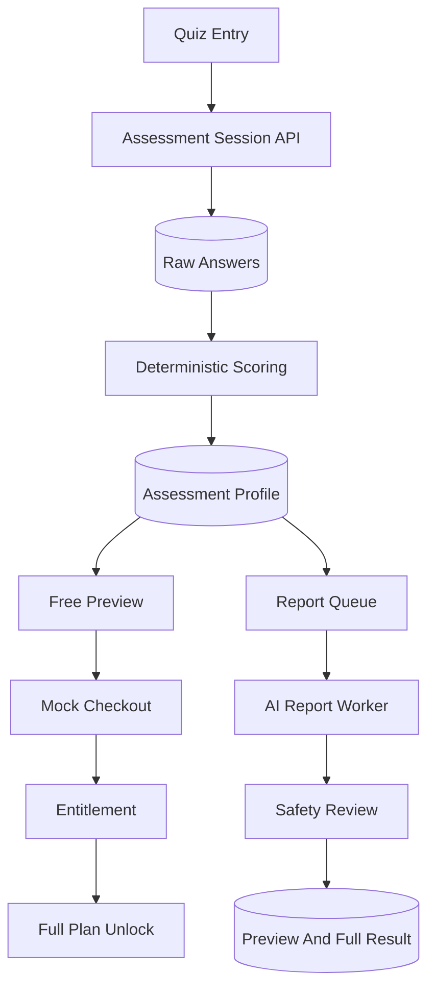

# Architecture

## Product Loop

## Design Principles

- **Backend first:** the challenge asks for API design, data modeling, flow closure, tests, and quality ownership.
- **Deterministic before AI:** scoring and constraints are computed before the writer step, so safety and tests do not depend on model output.
- **Versioned artifacts:** report jobs emit `health-profile`, `workout-plan`, and `safety-review` artifacts.
- **Entitlement boundary:** full content access is controlled by `Entitlement(scope="assessment.full_plan")` plus the session `subscriptionStatus`, and masking happens server-side in `GET /api/results/:id` (never client-side only).
- **Server-side health math:** BMI, calorie target and goal date are computed and persisted server-side (`AssessmentProfile.healthMetrics`), never trusted from the client.
- **Simulated payment:** `POST /api/pay` is the callback that flips `subscriptionStatus` to `ACTIVE`, records a `Payment`, and grants the entitlement in one transaction.
- **Resumable funnel:** anonymous token allows refresh/resume without forcing account creation before value is shown.

## Key Models

- `QuizDefinition`: active quiz JSON, versioned by slug/version.
- `AssessmentSession`: anonymous state machine, progress, and `subscriptionStatus`.
- `AssessmentAnswer`: raw answers, one per question.
- `AssessmentProfile`: derived signals, scores, risk flags, constraints, preview, and `healthMetrics` (BMI/intake/target date).
- `ReportJob`: async AI/report state.
- `AgentLog`: visible timeline of report stages.
- `ReportArtifact`: typed payloads for generated stages.
- `AssessmentResult`: preview and full plan payloads.
- `Payment`: mock checkout transaction.
- `Entitlement`: access rights.
- `FunnelEvent`: product analytics trail.

## Safety Layer

The app never claims diagnosis or treatment. Injury and limitation answers are turned into risk flags and plan constraints. The report generator includes a disclaimer and conservative adjustment rules. If multiple care areas are selected, the scorer emits a `stop` severity flag.
