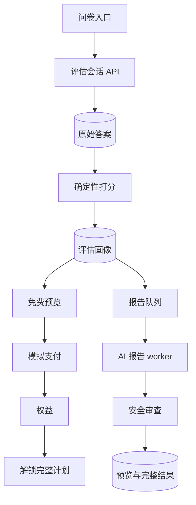

# 架构

## 产品闭环

## 设计原则

- **后端优先:** 挑战考查的是 API 设计、数据建模、流程闭环、测试和质量担当。
- **先确定性,后 AI:** 打分和约束在 writer 步骤之前就算好,因此安全和测试不依赖模型输出。
- **版本化产物:** 报告任务会产出 `health-profile`、`workout-plan`、`safety-review` 等产物。
- **鉴权边界:** 完整内容的访问权由 `Entitlement(scope="assessment.full_plan")` 加会话的 `subscriptionStatus` 控制;脱敏发生在服务端 `GET /api/results/:id`(绝不只在前端做)。
- **服务端健康计算:** BMI、热量目标和达标日期在服务端计算并持久化(`AssessmentProfile.healthMetrics`),绝不信任客户端。
- **模拟支付:** `POST /api/pay` 是回调,会在同一事务里把 `subscriptionStatus` 翻转为 `ACTIVE`、记录 `Payment` 并发放权益。
- **可恢复漏斗:** 匿名 token 允许刷新/恢复,无需在展示价值之前强制注册账号。

## 核心数据模型

- `QuizDefinition`:当前问卷 JSON,按 slug/version 版本化。
- `AssessmentSession`:匿名状态机、进度,以及 `subscriptionStatus`。
- `AssessmentAnswer`:原始答案,每题一条。
- `AssessmentProfile`:派生信号、分数、风险标记、约束、预览,以及 `healthMetrics`(BMI/建议摄入/达标日期)。
- `ReportJob`:异步 AI/报告状态。
- `AgentLog`:报告各阶段的可见时间线。
- `ReportArtifact`:各生成阶段的类型化产物。
- `AssessmentResult`:预览与完整计划的载荷。
- `Payment`:模拟支付交易。
- `Entitlement`:访问权。
- `FunnelEvent`:产品埋点轨迹。

## 安全层

应用从不声称诊断或治疗。受伤和限制类答案会被转化为风险标记和计划约束。报告生成器包含免责声明和保守的调整规则。如果选择了多个需要照顾的部位,打分器会产出 `stop` 级别的标记。
